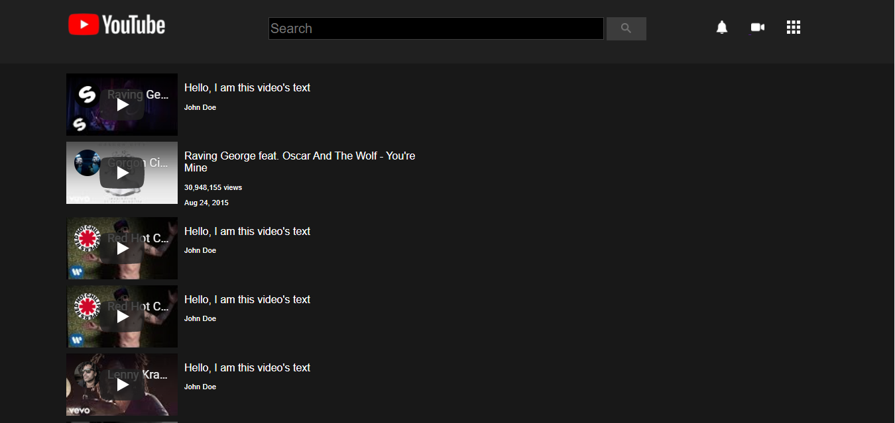

# YouTube

> This project consists of building an HTML document that matches the appearance of youtube video player page.
> 
> Additional description about the project and its features.

## Built With

- HTML,
- CSS

### Setup

> Clone the project into you directory and open it.

## Authors

**Eraani**

- Github: [@EraaniR](https://github.com/EraaniR)
  **Andgela**
- Github: [@410AndgelaVu](https://github.com/410AngelaVu)

## Contributing

Contributions, issues and feature requests are welcome!
Feel free to check the [issues page](issues/).

## Acknowledgments

- Hat tip to anyone whose code was used
- Inspiration
- etc

## License

This project is [MIT](lic.url) licensed.
